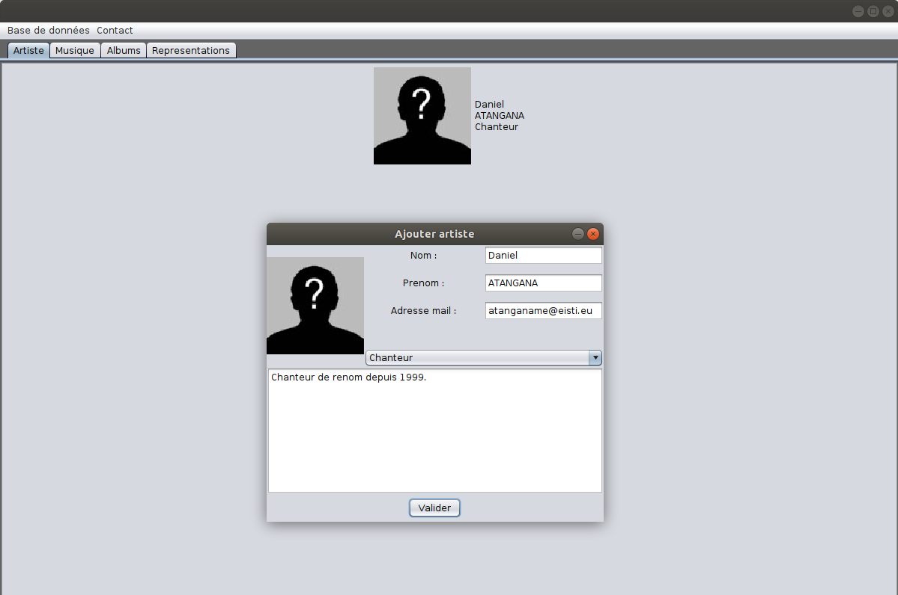
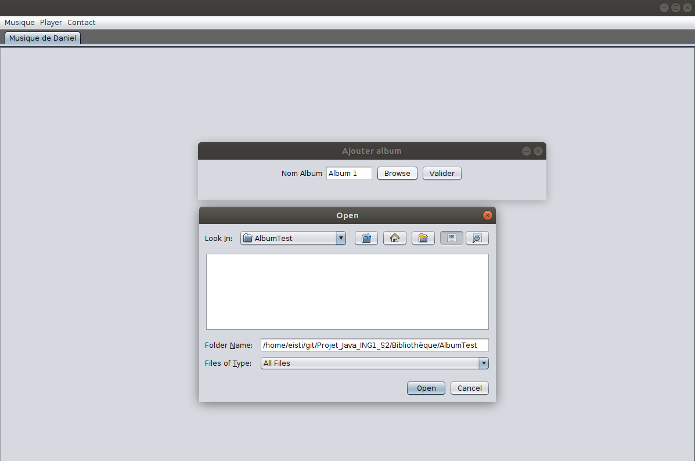
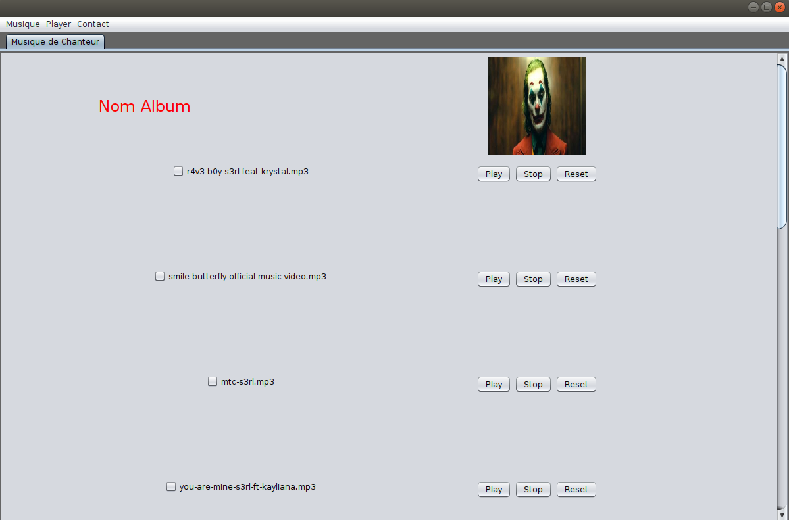
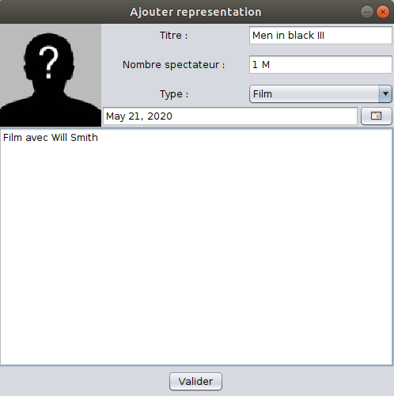
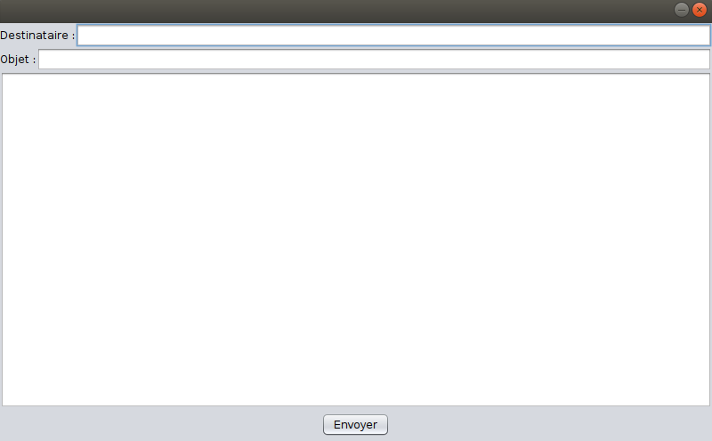

# Projet_Java_ING1_S2

## 1. Pour créer un compte/se connecter :

Si vous avez déjà un compte utilisateur de MySQL disposant de droits d'administrateur, entrez le nom d'utilisateur et le mot de passe dans l'espace prévu à cet effet.

Sinon, créez un compte en indiquant un nom d'utilisateur, un mot de passe ainsi que le mot de passe administrateur MySQL. Vous pourrez ensuite vous connecter comme indiqué à l'étape précédente.

Si vous voulez tester le mot de passe d'un utilisateur SQL à partir du terminal utilisez la commande : 
mysql -u "Nom utilisateur" -p

Si jamais vous ne connaissez pas votre mot de passe root et que vous voulez le changer suivez ce tuto :

<a>http://patatos.over-blog.com/article-comment-changer-le-mot-de-passe-de-mysql-49963936.html</a>

## 2. Après la connexion : 

Lorsque vos identifiants de connexion sont validés par le système, vous accédez à la page d'aacueil de l'application. Cette page initialement vide poura être complétée par des données via différentes méthodes : 
<ul>
 <li>Ajout par saisie</li>
 <li>Ajout par un fichier CSV</li>
 <li>Ajout par une base de données</li>
</ul>

### 2.1. Les onglets d'affichage

L'affichage de l'ensemble des informations disponibles se fait selon leur type, qui est donné par les onglets Artiste, Musique, Albums et Représentations. L'administrateur pourra ainsi visualiser les données des utilisateurs quelque soit leur talent. 

## 3. Remplissage manuel : 

La saisie manuelle d'un utilisateur se fait via le chemin "Base de données > ajouter artiste". Il donne accès à une fenêtre permettant de remplir les informations telles que le nom, prénom, e-mail, talent et description de l'artiste.

## 4. Remplissage à partir d'un fichier csv :

Il faut choisir un fichier avec la structure suivante:

<ul>
 <li>un dossier Albums avec les images des albums avec en nom: Album.jpeg (sans apostrophe (espace à la place), ni acccent) </li>

 <li>un dossier Artistes avec les images des artistes avec en nom: Nom.jpeg (sans apostrophe (espace à la place), ni acccent)</li>

 <li>un dossier Musiques avec les musiques des chansons avec en nom: Titre.mp3 (sans apostrophe (espace à la place), ni acccent)</li>

 <li>un dossier Representations avec les affiches des films ou des représentations avec en nom: Titre.jpeg (sans apostrophe (espace à la place), ni acccent)</li>
  
  
 <li>un fichier data.csv contenant les artistes et leurs oeuvres de la manière suivante:

une ligne par artiste avec ses oeuvres en suivant sur la même ligne.
La première ligne doit contenir les entêtes des colonnes:

**Nom** (de l'artiste), **Prenom** (de l'artiste), **Description** (ou bibliographie de l'artiste), **Profession** (de l'artiste), **Type** (de l'oeuvre), **Titre** (de l'oeuvre), **Annee** (de l'oeuvre), **Album** (de l'oeuvre si c'est une chanson), **Duree** (de l'oeuvre si c'est une chanson), **Spectateur** (de l'oeuvre si c'est une représentation),**...**

Toutes les colonnes (Type, Titre, Annee, Album, Duree, Spectateur) doivent être écrite sur la première ligne même si toutes les cases ne sont pas remplies. On répète (Type, Titre, Annee, Album, Duree, Spectateur) autant qu'il y a des oeuvres.
</li>

## 5. Gestion de l'interface chanteur : 

La saisie d'un chanteur crée une interface dédiée à ce groupe d'utilisateur, permettant d'ajouter une musique ou un album de l'artiste. Dans un premier temps, sur la page d'accueil se crée le profil de l'utilisateur ajouté, profil qui lorsqu'on clique dessus conduit au répertoire du chanteur. 
Depuis ce répertoire il est alors possible d'ajouter musique et album en utilisant les boutons dédiés.

### 5.1. Affichage et gestion des musiques

Après leur importation, les musiques de l'album sont affichées sur le répertoire du chanteur. A partir de cet instant il est possible de jouer une musique, la mettre en pause, l'arrêter ou encore la reprendre. Cette gestion se fait soit via les boutons de l'onglet "player" (en selectionnat au préalable la musique), soit directement sur l'interface en utilisant les boutons de gestion.

## 6. Gestion de l'interface acteur & comédien :

De manière analogue à la partie chanteur, les interfaces dédiées à la gestion des representation des acteurs et comédiens permettent l'ajout de nouvelles informations qui seront par la suite afficher sur la page d'accueil.

## 7. L'envoie d'e-mail

Il est possible pour l'administrateur d'envoyer des messages électroniquesa aux artistes de son choix. Cet envoi se fait via une fenêtre de message, où il devra saisir l'objet, le contenu et le destinataire du message. Cette interface est accessible en utilisant l'onglet "contact" de l'application. 

